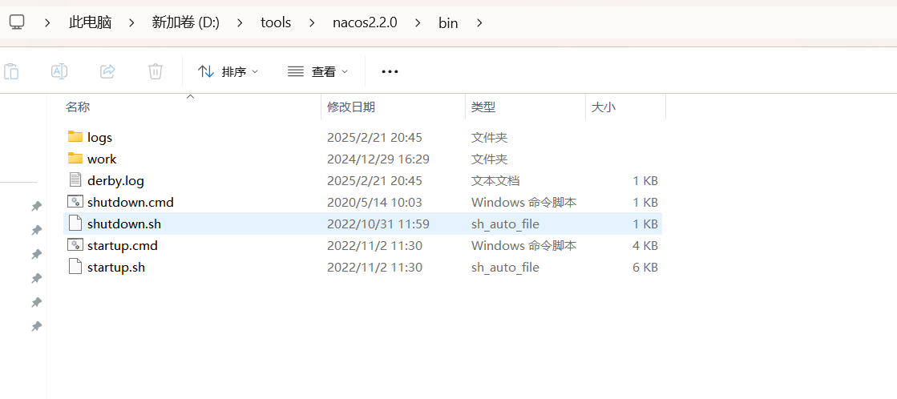
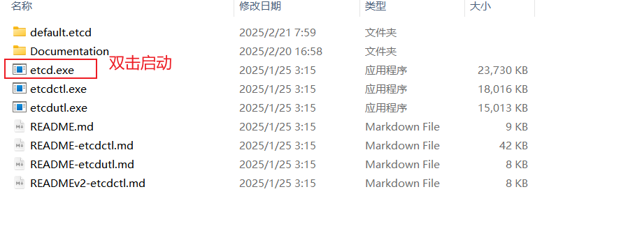
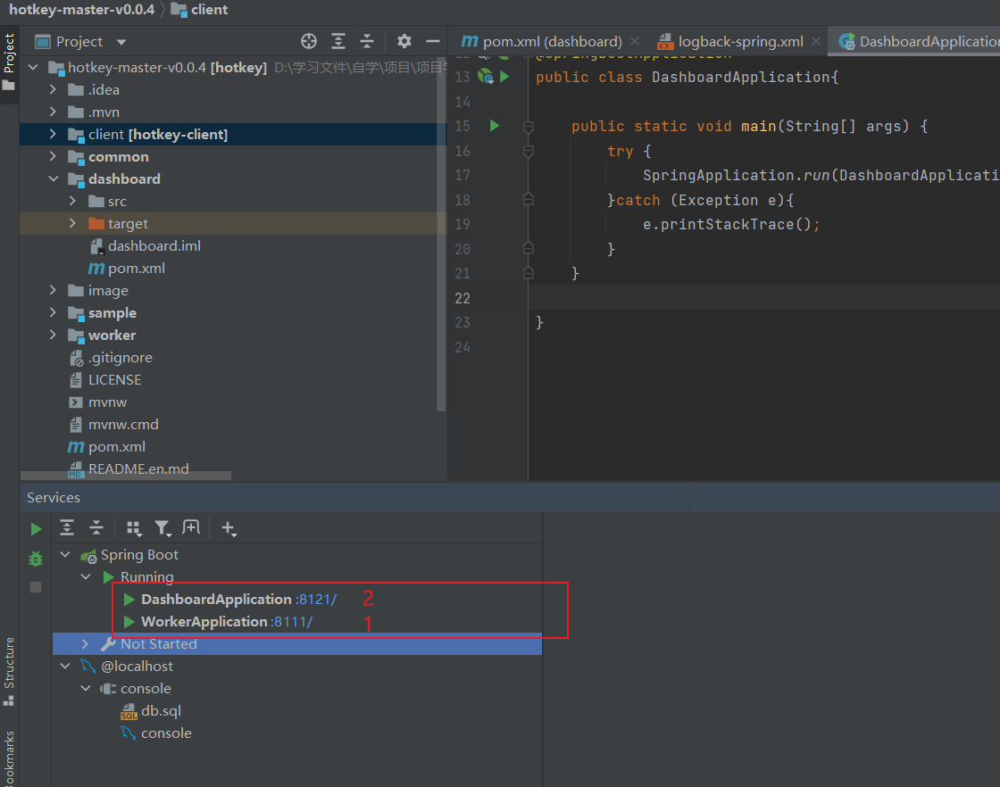
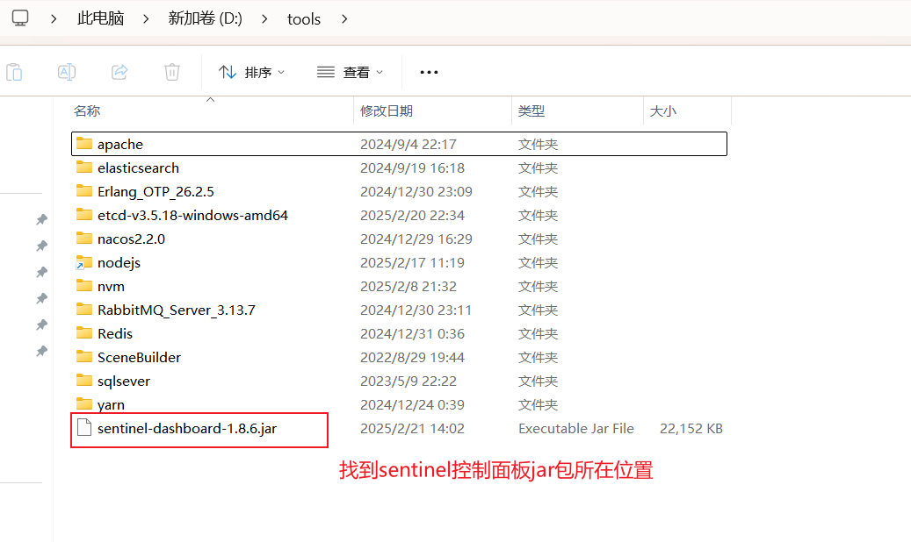

## 核心业务流程

如下图：

## 项目功能梳理

### 基础功能

- 用户模块
  - 用户注册
  - 用户登录（账号密码）
  - 【管理员】管理用户 - 增删改查

- 题库模块
  - 查看题库列表
  - 查看题库详情（展示题库下的题目）
  - 【管理员】管理题库 - 增删改查

- 题目模块
  - 题目搜索
  - 查看题目详情（进入刷题页面）
  - 【管理员】管理题目 - 增删改查（比如按照题库查询题目、修改题目所属题库等）

### 高级功能

- 题目批量管理
  - 【管理员】批量向题库添加题目
  - 【管理员】批量从题库移除题目
  - 【管理员】批量删除题目

- 分词题目搜索
- 用户刷题记录日历图
- 自动缓存热门题目
- 网站流量控制和熔断
- 动态 IP 黑白名单过滤
- 同端登录冲突检测
- 分级题目反爬虫策略

## 技术选型

### 前端

- React 18 框架
- ⭐️ Next.js 服务端渲染
- ⭐️ Redux 状态管理
- Ant Design 组件库
- 富文本编辑器组件
- ⭐️ 前端工程化：ESLint + Prettier + TypeScript
- ⭐️ OpenAPI 前端代码生成

### 后端

- Java Spring Boot 框架 + Maven 多模块构建
- MySQL 数据库 + MyBatis-Plus 框架 + MyBatis X
- Redis 分布式缓存 + Caffeine 本地缓存
- Redission 分布式锁 + BitMap + BloomFilter
- ⭐️ Elasticsearch 搜索引擎
- ⭐️ Druid 数据库连接池 + 并发编程
- ⭐️ Sa-Token 权限控制
- ⭐️ HotKey 热点探测
- ⭐️ Sentinel 流量控制
- ⭐️ Nacos 配置中心
- ⭐️ 多角度项目优化：性能、安全性、可用性

## 架构设计

## 环境准备

后端 JDK 版本需要使用 8、11 或 17，**不能超过 17！**

推荐使用 11 版本，因为 Caffeine 缓存要求使用 11 版本。

前端 Node.js 版本 >= 18.18。

## 项目启动前准备

### 必要：

Redis

MySQL

启动ElasticSearch 7.17.x 版本

启动Nacos2.2.0

> 在控制台进入nacos的bin目录，输入 `startup.cmd -m standalone`

启动etcd

### 非必要：

启动hotkey

> 通过idea启动hotkey，先启动worker,再启动dashboard

启动Sentinel控制面板

> 在控制台输入 `java -Dserver.port=8131 -jar sentinel-dashboard-1.8.6.jar	` 
> 账号名密码均为sentinel

启动nacos控制面板

>  启动nacos后直接访问http://127.0.0.1:8848/nacos ，账号名密码均为nacos

